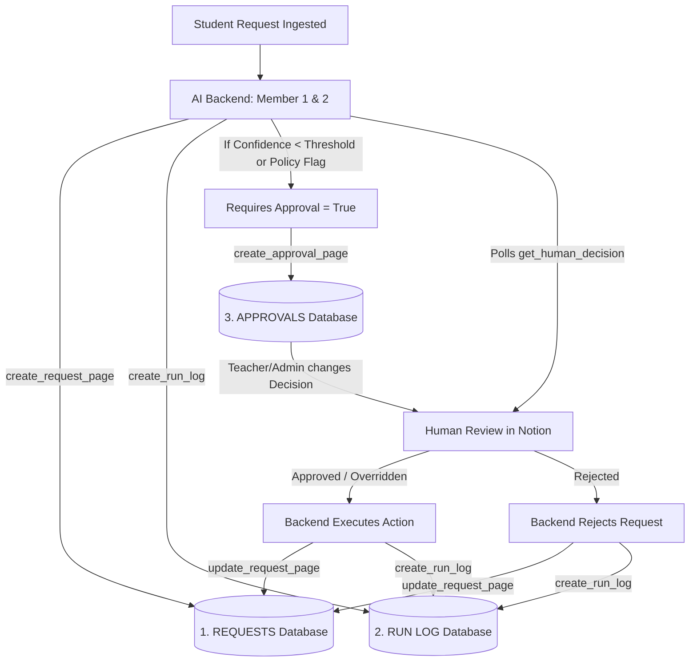
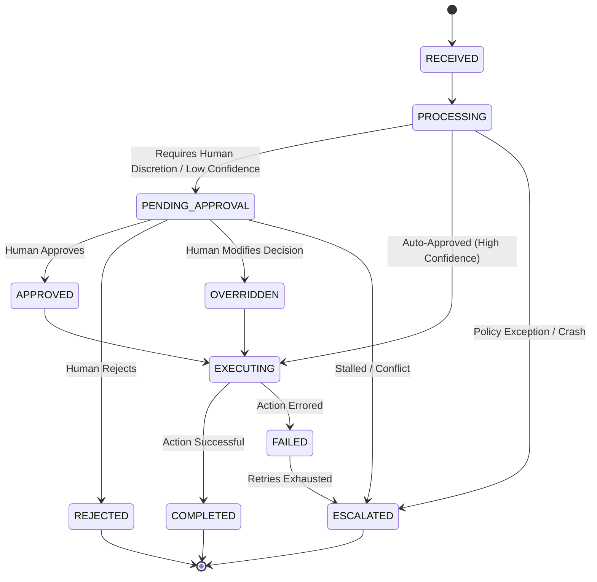

# Notion Database Schema & Architecture

**Project:** AI College Request Automation  
**Role:** Human Control Panel, Database, Approval Interface & Forensic Audit Trail

---

## Architecture Overview

Notion acts as the primary user interface for faculty, administration, and judges. It stores all student requests, facilitates human reviews, and records an immutable log of every action taken by the AI automation backend.



> [!IMPORTANT]
> **Core Principle:** Notion is NOT the execution engine. No Notion formulas, webhook buttons, or native automations directly trigger real-world actions. All decisions are polled and processed by the Python orchestrator.

---

## 1. REQUESTS Database (`Requests - AI College Operations`)

This database tracks all incoming student requests, AI classifications, prioritization scores, and downstream execution states.

### Properties

| Property Name | Notion Type | Description | Allowed / Example Values |
| :--- | :--- | :--- | :--- |
| **Title** | `title` | Brief request summary | e.g. `"CS101 Prerequisite Waiver - Alex Chen"` |
| **Request ID** | `rich_text` | Unique system identifier | e.g. `"REQ-2026-0821-4192"` |
| **Category** | `select` | Classified request type | `Course Registration`, `Leave Application`, `Fee Waiver`, `Hostel Request`, `Scholarship`, `Grade Appeal`, `General Query`, `IT Support`, `Transcript Request` |
| **Requester** | `rich_text` | Student name or email | e.g. `"alex.chen@university.edu"` |
| **Original Request** | `rich_text` | Full unedited student prompt | e.g. `"I need to register for CS201 but haven't completed Math 102..."` |
| **AI Summary** | `rich_text` | Clean 1-2 sentence AI overview | e.g. `"Alex Chen is requesting waiver for MATH102 prerequisite based on AP Calculus BC score."` |
| **AI Recommendation** | `rich_text` | Proposed backend action | e.g. `"Approve conditional enrollment pending AP credit transcript verification."` |
| **Priority** | `select` | Urgency tier | `low`, `medium`, `high`, `urgent` |
| **Confidence** | `number` | AI classification confidence | Number between `0.0` and `1.0` |
| **Status** | `select` | Current workflow state | See **Status Lifecycle** below |
| **Requires Approval** | `checkbox` | Needs human sign-off | `true` / `false` |
| **Human Decision** | `select` | Decision made by human | `pending`, `approved`, `rejected`, `overridden` |
| **Created At** | `date` | Timestamp received (UTC) | ISO 8601 (e.g. `2026-08-21T07:00:00Z`) |
| **Updated At** | `date` | Timestamp last modified (UTC) | ISO 8601 |
| **Action Result** | `rich_text` | Real-world execution summary | e.g. `"Enrolled in CS201 Section A. Confirmation email sent to student."` |

### Status Lifecycle State Machine



---

## 2. APPROVALS Database (`Approvals - Human Review Queue`)

This database is dedicated to human faculty/administrators reviewing requests flagged by the AI.

### Properties

| Property Name | Notion Type | Description | Allowed Values |
| :--- | :--- | :--- | :--- |
| **Request ID** | `title` | Unique reference ID | e.g. `"REQ-2026-0821-4192"` |
| **Request** | `rich_text` | Short human summary for quick skimming | e.g. `"Alex Chen: Prerequisite waiver for CS201 with AP Calc 5."` |
| **Decision** | `select` | Human decision status | `pending`, `approved`, `rejected`, `override_approved` |
| **Reviewer** | `rich_text` | Name or ID of human reviewer | e.g. `"Prof. Sarah Jenkins"` |
| **Decision Reason** | `rich_text` | Human's justification | e.g. `"Verified AP credit matches department syllabus standard."` |
| **Decision Time** | `date` | Time human saved decision | ISO 8601 (UTC) |
| **Override Instructions** | `rich_text` | Custom execution instructions if overridden | e.g. `"Enroll in Section B instead of Section A due to class cap."` |

---

## 3. RUN LOG Database (`Run Log - Audit Trail`)

This database provides an immutable forensic record of every AI step, policy evaluation, and human decision.

### Properties

| Property Name | Notion Type | Description | Allowed Values |
| :--- | :--- | :--- | :--- |
| **Run ID** | `title` | Unique log entry ID | e.g. `"RUN-20260821070000-8472"` |
| **Request ID** | `rich_text` | Associated request ID | e.g. `"REQ-2026-0821-4192"` |
| **Timestamp** | `date` | Event timestamp (UTC) | ISO 8601 |
| **Event** | `rich_text` | Semantic event name | `REQUEST_RECEIVED`, `POLICY_EVALUATED`, `HUMAN_APPROVAL_REQUESTED`, `DECISION_RECORDED`, `ACTION_EXECUTED` |
| **Actor** | `select` | Responsible entity | `system`, `AI`, `human` |
| **Action** | `rich_text` | Concrete operation | e.g. `"Checked GPA and prerequisite records in SIS"` |
| **Status** | `select` | Step outcome | `SUCCESS`, `INFO`, `WARNING`, `ERROR`, `PENDING`, `IN_PROGRESS` |
| **Reason** | `rich_text` | Rationale / context | e.g. `"Student meets 3.5 GPA threshold"` |
| **Error** | `rich_text` | Error message (if any) | e.g. `""` |
| **External Action ID** | `rich_text` | External system reference | e.g. `"SIS-TXN-98273"`, `"EMAIL-MSG-48291"` |

---

## 4. Notion Service API Contracts (`notion_service.py`)

All backend Python services interact through these 6 functions:

```python
# 1. Create Request
create_request_page(
    request_id: str,
    title: str,
    category: str,
    requester: str,
    original_text: str,
    ai_summary: str,
    ai_recommendation: str,
    priority: str,
    confidence: float,
    status: str,
    requires_approval: bool
) -> str # returns notion_page_id

# 2. Update Request State
update_request_page(
    notion_page_id: str,
    status: str,
    human_decision: str | None = None,
    action_result: str | None = None
) -> None

# 3. Create Approval Entry
create_approval_page(
    request_id: str,
    request_summary: str
) -> str # returns notion_page_id

# 4. Fetch Pending Queue
get_pending_approvals() -> list[dict]
# Returns:
# [{"request_id": "REQ-101", "decision": "pending", "reviewer": "", "reason": "", "override_instructions": ""}, ...]

# 5. Poll Human Decision
get_human_decision(request_id: str) -> dict | None
# Returns None if pending, or:
# {"decision": "approved"|"rejected"|"override_approved", "reviewer": "Prof. Jenkins", "reason": "Verified AP score"}

# 6. Append Run Log
create_run_log(
    request_id: str,
    event: str,
    actor: str,
    action: str,
    status: str,
    reason: str = "",
    error: str = "",
    external_action_id: str = ""
) -> str # returns notion_page_id
```

---

## 5. Resilience & Guardrails

1. **Rate Limiting (HTTP 429):** Automatic exponential backoff with jitter and `Retry-After` header inspection.
2. **Text Chunking:** Splits strings exceeding 1900 characters into multiple rich text nodes to adhere to Notion's 2000 character limit.
3. **Anti-JSON Guard:** Detects and unwraps raw JSON objects in AI summary/recommendation fields into human-readable sentences for presentation to judges.
4. **Exception Handling:** Unhandled Notion API failures raise `NotionServiceError` containing status code and error response for clean routing to `ESCALATED`.
